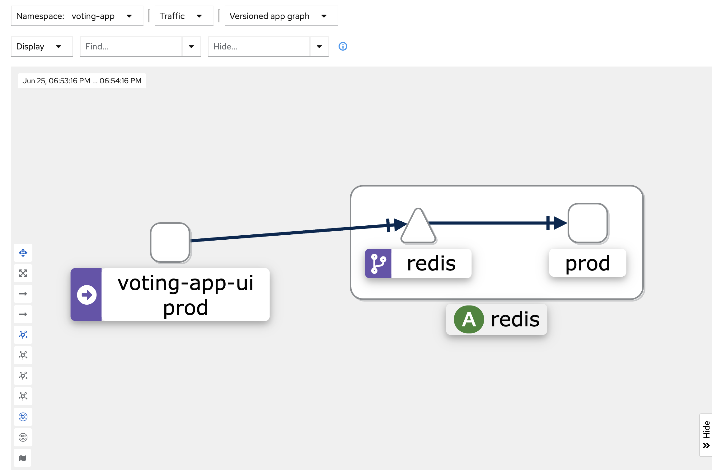
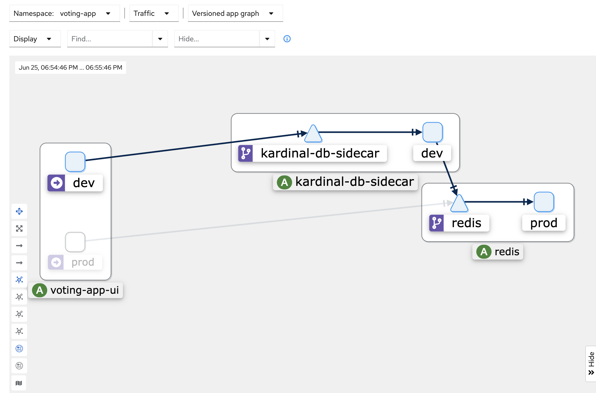

# 🎡 Kardinal Playground

Welcome to the Kardinal Playground! This GitHub Codespace comes with Kardinal and all necessary tools pre-installed and ready to go. 🚀

## 🛠 Features

- 🐦 Kardinal: Our platform that allows you to dev on prod safely
- 🚙 Minikube: A tool that lets you run Kubernetes locally
- 🎛 kubectl: The command-line tool for interacting with Kubernetes clusters
- 🌐 Istio: An open-source service mesh that layers transparently onto existing distributed applications
- 📊 Kiali: A management console for Istio-based service mesh

## 🚀 Getting Started

[](https://github.com/codespaces/new?hide_repo_select=true&ref=main&repo=818205437&skip_quickstart=true&machine=standardLinux32gb&devcontainer_path=.devcontainer%2Fdevcontainer.json)

1. 🏗 Create a new Codespace from this repository.
2. ⏳ Wait for the Codespace to finish setting up. This includes installing all necessary tools and starting Minikube.
3. 🎉 Once setup is complete, you're ready to start your Kardinal adventure!

## 📊 About the Voting App

The voting app is a simple application composed of two main components:

1. A Python Flask web application that allows users to vote between two options.
2. A Redis database that stores the votes.

This setup demonstrates a basic microservices architecture, making it an ideal example for showcasing Kardinal's capabilities in managing development environments.

## 🗺 Usage Guide

Follow these steps to explore the Kardinal Playground and experience the before → after progression:

1. 🏁 Run the startup script:
   ```
   ./scripts/startup.sh
   ```
   This will set up Docker, Minikube, Istio, Kiali, and Kardinal for you, and deploy the voting-app namespace to the Minikube cluster. 

   This can take around 3 minutes 🕰️. Familiarize yourself with the repository while this happens. 

   The script also supports a `--verbose` mode if you want to see what it's doing in detail.

2. 🗳 Explore the production voting app:
   - Check the "Ports" tab in the Codespaces UI
   - Look for the port labelled "voting-app-prod" and open it in your browser
   - Click on the voting buttons to generate some traffic

3. 📊 Visualize the production structure in Kiali:
   - Get your Codespace URL by running:
     ```
     echo "https://$CODESPACE_NAME-20001.app.github.dev/kiali/console/graph/namespaces/?duration=60&refresh=10000&namespaces=voting-app&idleNodes=true&layout=kiali-dagre&namespaceLayout=kiali-dagre&animation=true"
     ```
   - Open the URL provided by the command above in your browser
   - Observe the current structure of the production environment
   - Note: If you're having trouble viewing Kiali, refer to the "Screenshots" section at the end of this README to see what the production environment should look like

4. 🔧 Set up the dev flow:
   ```
   kardinal create-dev-flow voting-app
   ```
   This command will handle the deployment and port forwarding for you.

5. 🧪 Interact with the dev version:
   - Check the "Ports" tab in the Codespaces UI
   - Look for the port labelled "voting-app-dev" and open it in your browser
   - Click on the voting buttons in the dev version to send traffic through it

6. 🔍 Compare the new structure in Kiali:
   - Go back to the Kiali dashboard
   - Notice the changes in the environment:
     - A dev version is now deployed
     - Dev traffic is routed to the dev version, with a database sidecar protecting the data layer
     - Prod still works independently - go to the prod version and click, it goes to the prod version and speaks to the DB directly
   - If Kiali isn't displaying correctly, check the "Screenshots" section at the end of this README to see what the development environment should look like

7. 🔄 Verify prod functionality:
   - Return to the production voting app URL
   - Confirm that it still works and interacts with the database directly

8. 🧹 Clean up the dev flow:
   ```
   kardinal delete-dev-flow voting-app
   ```

9. 🔎 Final Kiali check:
   - Return to the Kiali dashboard one last time
   - Observe that the environment has been cleaned up and returned to its original state
   - If you can't access Kiali, refer to the production environment screenshot in the "Screenshots" section to see what the final state should resemble

This guide showcases the power of Kardinal by demonstrating the seamless creation and deletion of a dev environment alongside your production setup. You'll experience firsthand how Kardinal enables isolated development without risking production data or disrupting the live environment. 🚀

## 🔗 Port Forwarding Explanation

We're using port forwarding in this Codespace setup to make the various services accessible to you. Since the Minikube cluster is running inside the Codespace, we need to forward specific ports to allow you to interact with the applications and dashboards through your browser. This is why you'll see multiple forwarded ports in the "Ports" tab of the Codespace UI.

If you encounter any issues with port forwarding, you can reset it by running:
```
./scripts/forward.sh
```

## 📸 Screenshots

### Production Environment

*This image shows the Kiali graph for the production environment, demonstrating the direct connection between the voting app and the Redis database.*

### Development Environment

*This image displays the Kiali graph for the development environment, showcasing the additional components introduced by Kardinal, including the dev version of the app and the database sidecar.*

## ⏩ What's Next?

We are working with a small but selective set of initial users, join the beta [here](https://kardinal.dev/?utm_source=github). Or even better email us at `hello@kardinal.dev`.

## 🐛 Issues

If you run into any issues with this playground please create an issue here or email us at `hello@kardinal.dev`.

If you are encountering any issue with the port forwards, simply use `./scripts/forward.sh` to reset the port forwarding.
